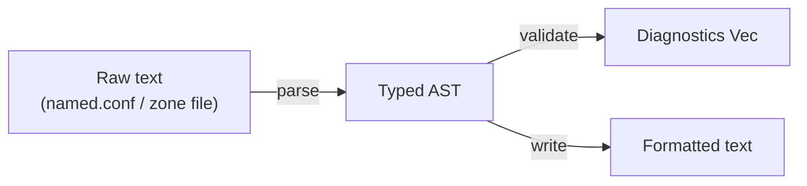

# Concepts Overview

This section explains the key ideas behind Hornet's design so you can use the library
confidently and extend it when needed.

---

## The processing pipeline

Hornet models BIND9 file processing as three independent, composable stages:



Each stage is independent:

- **Parse** — convert raw text into a typed Rust AST. Fails fast on syntax errors.
- **Validate** — run semantic checks on a successfully parsed AST. Returns a list of diagnostics;
  never panics or mutates the AST.
- **Write** — serialise any AST back to valid BIND9 text. Controlled by [`WriteOptions`](../reference/write-options.md).

You can use any stage in isolation. Validation and writing both require a successfully parsed AST,
but you do not need to validate before writing.

---

## Two file types, one API shape

Hornet handles two distinct BIND9 file formats, each with its own AST:

| File type | Parse function | AST root | Write function |
|---|---|---|---|
| `named.conf` | `parse_named_conf()` / `parse_named_conf_file()` | `NamedConf` | `write_named_conf()` |
| Zone file | `parse_zone_file()` / `parse_zone_file_from_path()` | `ZoneFile` | `write_zone_file()` |

Both follow the same ergonomic pattern:

```rust
let ast  = hornet::parse_named_conf(text)?;
let diag = hornet::validate_named_conf(&ast);
let out  = hornet::write_named_conf(&ast, &WriteOptions::default());
```

---

## Concepts

- [Architecture](./architecture.md) — Internal module structure and design decisions
- [named.conf Format](./named-conf.md) — Statements, blocks, and address match lists
- [Zone Files](./zone-files.md) — Directives, record types, and the zone file AST
