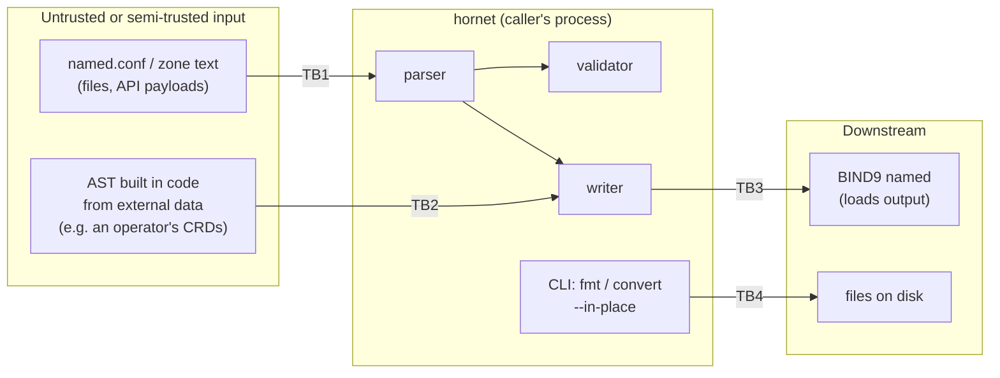

# Threat Model

**Last Updated:** 2026-10-05
**Version:** 1.3
**Last full pass 2026-10-05, against ADR-0001 ... ADR-0004**

This is hornet's threat model: what it protects, who can reach it, where the
trust boundaries are, and which control (or accepted risk, or open finding)
answers each threat. It is maintained under the Architecture Driven Development
rule (`.claude/rules/architecture-driven-development.md`): every implemented ADR
ends with a full pass over this page and a bump of the stamp above.

The first pass was verified against `main` @ `10fee80` by reading `src/` and by
running probes against the library. The third pass (v1.2) re-verified every
row against the 0.2.0 tree after ADR-0003, with the injection payloads from
section 6 run through real BIND9 9.18 and 9.20. The fourth pass (v1.3) walked
every section again after ADR-0004 (typed `dnssec-policy`, `print-time` and
options; `miette/fancy` only with `cli`), with the new writer positions and
validator rules checked against `named-checkconf` on BIND 9.18 and 9.20. It
found no new vulnerability; it added T12 and AR4 and updated T1 to T4, T9, TB2
and section 8.

---

## 1. System overview

hornet is a single Rust crate, `hornet-bind9`, released under Apache-2.0:

- a **library** that parses BIND9 `named.conf` and RFC 1035 zone files into an
  AST (`src/parser/`, built on `winnow`), writes an AST back to text
  (`src/writer/`), and validates an AST (`src/validator/`);
- an optional **CLI**, `hornet` (feature `cli`, on by default), with `parse`,
  `zone`, `check`, `check-zone`, `fmt` and `convert` subcommands
  (`src/main.rs`).

Programs that embed hornet (such as the bindy operator, which validates and
renders the `named.conf` its BIND9 pods load) build the library alone, with
`default-features = false`.

hornet has no network surface, no daemon, no privileges of its own, no unsafe
code and no persistent state. It runs with whatever authority its caller has.
Its security relevance comes from **where its output goes**: BIND9 loads it, and
BIND9 is an internet-facing authoritative or recursive server.

## 2. Assets

| Asset | Why it matters |
|---|---|
| **Integrity of emitted configuration** | BIND9 trusts it completely. An injected `allow-update { any; };`, `allow-transfer`, an extra zone, or an extra resource record is a DNS takeover or data-exposure primitive. An altered `dnssec-policy` (a weaker algorithm, an extra key, a zone moved to `insecure`) silently weakens or removes signing. |
| **Fidelity of the parse** | Callers use hornet's AST and validator to decide whether a config is acceptable. If hornet reads a file differently from BIND9, a policy check passes on text BIND interprets otherwise. |
| **Availability of the calling process** | hornet runs inside CI linters, operators and tools that parse configs they did not write. |
| **User files touched by the CLI** | `fmt` and `convert --in-place` overwrite the file they read. |
| **Release artefacts** | Binaries, SBOMs and the crates.io package are consumed by other projects. |

## 3. Actors

| Actor | Capability |
|---|---|
| **Config author** | Writes `named.conf` / zone text that hornet parses. Fully trusted in the single-user CLI case; untrusted when hornet is used to vet submissions (a review bot, a multi-tenant operator). |
| **Data supplier to an embedding program** | Controls strings that the embedding program places into AST fields (zone names, TXT data, key names, file paths, DNSSEC policy names, algorithms and key lifetimes) before calling the writer. Never trusted. |
| **Embedding developer** | Calls the library. Trusted, but can only be as safe as the writer's escaping contract lets them be. |
| **Supply-chain attacker** | Targets a dependency, a GitHub Action, the release pipeline or the crates.io publish token. |

## 4. Trust boundaries

| ID | Boundary | What crosses it |
|---|---|---|
| **TB1** | Text into the parser | Arbitrary bytes from a file or string, size unbounded by hornet |
| **TB2** | Caller-built AST into the writer | Arbitrary `String` values in AST fields, including the raw `extra` (options, zone, view, server and, since ADR-0004, `dnssec-policy`), `Statement::Unknown` and `RData::Unknown` carriers |
| **TB3** | Writer output into BIND9 | Text BIND9 parses with its own lexer and quoting rules |
| **TB4** | CLI to filesystem | Read of a user-supplied path; for `fmt` and `convert --in-place`, an overwrite of that path |
| **TB5** | Source to release | GitHub Actions, third-party actions, crates.io dependencies, the publish token |

## 5. STRIDE analysis

| # | STRIDE | Threat | Boundary | Control / disposition |
|---|---|---|---|---|
| T1 | **T**ampering | A string in an AST field breaks out of its quoting in the writer and injects directives or records into the emitted config | TB2, TB3 | **Controlled** (ADR-0003, F2/F3 fixed). Every modelled string has one treatment by position: string positions are always quoted and escaped; name and keyword positions are bare only when plain and not reserved, otherwise quoted; zone files use RFC 1035 escaping (`\"`, `\\`, `\DDD`) for character-strings, names and tokens. Injection payloads in every position stay one token in real BIND9. ADR-0004 adds two token positions that BIND accepts only unquoted, the `dnssec-policy` key `algorithm` and every duration / key lifetime: each is written bare only when it matches its grammar (ASCII letters and digits; `is_duration`) and quoted otherwise, and `named-checkconf` rejects the quoted form ("expected unquoted string", "expected ISO 8601 duration or TTL value"), so the writer fails closed. Policy names, `key-store` names, `cds-digest-types` entries and the new `options` `key-directory` / `dnssec-policy` are string positions. A round-trip test writes hostile text into every one of these and re-parses to the same statement count. The raw carriers (`extra`, including `DnssecPolicyStmt::extra`, `Statement::Unknown`, `RData::Unknown`) remain verbatim by design and are documented as trusted-input only; zone raw fields still have control characters escaped, so they cannot start a new line. With ADR-0004 nothing bindy emits needs a raw carrier. |
| T2 | **T**ampering | hornet's parse differs from BIND9's, so a config passes hornet's validator but BIND9 loads something else | TB1, TB3 | **Controlled** (ADR-0003, F4/F5/F7 fixed): quoted strings honour `\"`; unmodelled statements are captured quote- and comment-aware; keywords and address-match literals match whole words; zone files use only `;` comments and decode `\DDD`. Zone lines hornet cannot read are a parse error with a line number instead of being skipped, and record data that does not match its type is kept verbatim with a validator warning, so nothing disappears from the AST. Residual: hornet still accepts some inputs BIND rejects (verbatim records, unmodelled options), which is why the validator is advisory and AR3 stands. The e2e oracle (ADR-0001) compares BIND's canonical form of each fixture with hornet's output. ADR-0004 closed two places where hornet saw less than BIND: `logging` with `print-time iso8601` and every `dnssec-policy` block used to fall back to `Statement::Unknown`, so their contents were only brace-checked; both are now typed, validated and in the e2e corpus. Duration tokens are kept as written, because BIND prints TTL values and ISO 8601 durations differently. |
| T3 | **D**enial of service | Crafted or merely large input makes parsing super-linear | TB1 | **Controlled** (ADR-0003, F1 fixed). Keyword matching compares only the keyword-length prefix; a regression test asserts parse time does not depend on the size of the remaining input. The `dnssec-policy` parser (ADR-0004) re-scans a clause at most once when its typed parse fails (to keep it verbatim), and the duration and key-role checks are single passes, so parsing stays linear. |
| T4 | **D**enial of service | Deep nesting overflows the stack | TB1 | **Not exposed.** The named.conf grammar hornet implements is not recursive: address-match-list negation is one level (`!elem`), nested `{ }` lists are not parsed, views contain zones only, a `dnssec-policy` `keys` clause is one fixed level of `{ }`, and the `Unknown` statement fallback (`unknown_stmt`) and `take_to_semi` track brace depth with an iterative counter, not recursion. The writer recurses only along the same fixed structure. |
| T5 | **D**enial of service | Huge input exhausts memory | TB1, TB4 | Accepted risk **AR1**. `parse_named_conf_file` / `parse_zone_file_from_path` read the whole file with `read_to_string`; there is no size cap. |
| T6 | **I**nformation disclosure / **E**levation | `include` or `$INCLUDE` makes hornet read files outside the intended tree (path traversal) | TB1, TB4 | **Not exposed.** hornet never follows includes: `include "path";` becomes `Statement::Include(path)` and `$INCLUDE` becomes `Entry::Include { file, .. }`; neither is opened. The CLI reads only the path given on its command line. Consumers that resolve includes themselves own that check. |
| T7 | **T**ampering | `fmt` / `convert --in-place` silently destroys content | TB4 | **Controlled** (ADR-0003, F6 fixed). The AST still has no place for comments, so `fmt` and `convert --in-place` refuse to rewrite a file that contains any unless `--force` is given, and warn when they proceed; stdout modes warn that comments were omitted. The CLI reads each input exactly once, so the comment check and the parse see the same text. Writes are a plain `std::fs::write` (non-atomic, follows symlinks); acceptable for a user-invoked CLI, see **AR2**. |
| T8 | **R**epudiation | A change to parser/writer behaviour lands without a record | TB5 | `.claude/CHANGELOG.md` entries with a mandatory `**Author:**`, signed and signed-off commits verified in CI (`verify-signed-commits`), ADRs for behaviour-changing decisions. |
| T9 | **T**ampering | A compromised dependency or GitHub Action ships in a release | TB5 | Small dependency surface (`winnow`, `thiserror`, `miette`, optional `clap` / `serde`); since ADR-0004 miette's terminal rendering stack (`owo-colors`, `supports-*`, `terminal_size`, `textwrap`, `backtrace`) is compiled only with the `cli` feature, so a library-only build resolves 15 crates instead of 71; `cargo audit` in CI; SPDX header check; Cosign-signed release tarballs, CycloneDX SBOMs and SLSA provenance; actions pinned by commit SHA and Dependabot-tracked (ADR-0001). Coverage tooling (ADR-0002) adds `cargo-llvm-cov` (installed by a SHA-pinned action) and a Codecov upload; neither affects what is built or released, and Codecov is a reporting sink, never a gate. |
| T10 | **S**poofing | A forged hornet release or crate | TB5 | Cosign keyless signatures and SLSA provenance on GitHub release assets. crates.io publication relies on the `CARGO_REGISTRY_TOKEN` secret, scoped to the release job. |
| T11 | **I**nformation disclosure | TSIG secrets in `key` statements leak via error output | TB1 | Low. Parse errors carry the source text in a `miette::NamedSource`; a caller that prints diagnostics for a file containing `secret "..."` can echo it. The validator does not log key material. Callers handling secrets should not forward diagnostics to shared logs. |
| T12 | **D**enial of service | The validator reports an Error on a configuration BIND9 accepts, and a program that gates on hornet (bindy refuses to publish a ConfigMap with an Error finding) blocks a valid change | TB1, TB2 | **Controlled** (ADR-0004). Every Error-severity `dnssec-policy` rule was reproduced with `named-checkconf` on BIND 9.18 and 9.20 before it was made an Error; rules that differ by version (algorithm support, `nsec3param iterations`) or that hornet's grammar may not cover (a clause kept verbatim) are Warnings; a global `dnssec-policy` naming an undefined policy is reported only for zones that inherit it, as BIND does. The e2e suite runs `hornet check` on every fixture and fails on any Error for a file BIND accepts. Failure mode if a rule is wrong: the gating program keeps the previous configuration (fail closed), not an outage. |

## 6. Findings

All seven findings from the first pass (2026-10-05) were tracked privately
under the coordinated-disclosure policy in
[`SECURITY.md`](https://github.com/firestoned/hornet/blob/main/SECURITY.md)
and fixed before 0.2.0, test-first, under
[ADR-0003](https://github.com/firestoned/hornet/blob/main/docs/adr/0003-writer-escaping-contract-and-input-hardening.md).
New findings follow the same path: private until fixed, then listed here.
The fourth pass (ADR-0004) found none.

| ID | Finding | Severity | Fixed in | Fix |
|---|---|---|---|---|
| **F1** | `keyword()` lowercased the entire remaining input on every attempt: parse time grew with the square of the input size (16,000 zones took about a second), and keywords matched as prefixes (`zonex` matched `zone`) | Medium | 0.2.0 | Compare only the keyword-length prefix, case-insensitively, and require a word boundary. Pinned by a test that parse time does not depend on the remaining input. |
| **F2** | The zone-file writer escaped `"` but not `\` in TXT strings: a value ending in a backslash closed the string early, and with an embedded newline the rest became new records (verified: an attacker-chosen `A` record) | High for programs that build zone ASTs from untrusted data | 0.2.0 | RFC 1035 character-string escaping for every string field (`\"`, `\\`, `\DDD` for control and non-ASCII bytes), matching decoding in the parser. `parse(write(x)) == x` is tested for adversarial strings, and BIND9 reads the payload as one TXT record. |
| **F3** | Several writer paths interpolated AST strings unescaped: zone owner names and RDATA names, the `$INCLUDE` path, named.conf ACL references, key `algorithm`, and others | Medium (design gap) | 0.2.0 | Position-based quoting and escaping in both writers (ADR-0003, decision 1). Raw carriers stay verbatim and are documented as trusted-input only. |
| **F4** | `quoted_string` ended at the first `"`, even after a backslash: `zone "a\"b"` fell through to `Statement::Unknown`, invisible to validation, while BIND9 reads a zone named `a"b` | Medium | 0.2.0 | End at the first unescaped `"`. |
| **F5** | Capture of unmodelled options and statements stopped at the first `;` or `}` even inside quoted strings or comments, so hornet's view of later statements differed from BIND9's | Low | 0.2.0 | The scanner skips quoted strings and comments. |
| **F6** | `fmt` and `convert --in-place` deleted every comment in the file they rewrote | Low (data loss) | 0.2.0 | Refuse unless `--force`; warn when proceeding (ADR-0003, decision 4). |
| **F7** | Address-match literals matched as prefixes: an ACL named `anyone` or `nonexistent` matched `any` / `none`, the list failed, and the statement fell back to `Unknown` | Low | 0.2.0 | Whole-word matching; a quoted name is always an ACL reference. |

## 7. Accepted risks

| ID | Risk | Why accepted | Revisit when |
|---|---|---|---|
| **AR1** | No input size limit; files are read fully into memory | hornet's inputs are config files, normally kilobytes to low megabytes. Callers that accept untrusted uploads can bound size before calling hornet. | hornet is embedded in a service that accepts uploads. (Parse time is linear since F1 was fixed, so size now costs memory, not quadratic CPU.) |
| **AR2** | `fmt` / `convert --in-place` use a non-atomic `std::fs::write` that follows symlinks | The CLI is user-invoked on the user's own files with the user's own permissions; it is not a privileged tool. | hornet's CLI is run by a privileged process or on paths an untrusted party controls. |
| **AR3** | `named-checkconf` acceptance (ADR-0001) is necessary, not sufficient | The checkers validate syntax and much semantics but do not load a running server. | A defect reaches a release that `named-checkconf` accepted but `named` rejected at load. |
| **AR4** | Version-specific grammar is modelled but not gated: hornet writes a `dnssec-policy` clause BIND 9.20 added (`key-store`, `tag-range`, `cdnskey`, ...) even for a 9.18 server, and does not check 9.20-only rules such as minimum key lifetimes | It fails closed: BIND 9.18 rejects the file and keeps running the previous one. The validator warns where 9.20 is stricter. Version-aware validation and writing is roadmap 00. | Roadmap 00 lands, or a caller needs hornet to refuse version-incompatible output itself. |

## 8. Supply chain

- **License:** Apache-2.0, with SPDX headers enforced in CI.
- **Dependencies:** `winnow`, `thiserror`, `miette`; optional `clap` (pinned to
  `=4.4.18`) and `serde`. miette's `fancy` feature is enabled only by `cli`
  (ADR-0004), so library consumers do not compile its terminal stack. `cargo audit` and `cargo deny`
  run in CI. `Cargo.lock` is committed and every build uses `--locked`, so CI
  and release builds compile exactly the reviewed dependency graph.
- **CI:** composite actions from `firestoned/github-actions`; third-party
  actions pinned by commit SHA and updated by Dependabot, with auto-merge gated
  on the BIND9 e2e suite (ADR-0001, roadmap 01). Branch protection on `main`
  requires a pull request, signed commits, and the `PR Checks Passed` and
  `E2E gate` checks, for administrators too.
- **Coverage reporting (ADR-0002):** coverage jobs upload LCOV to Codecov with
  the `CODECOV_TOKEN` repository secret. The workflows trigger on
  `pull_request`, not `pull_request_target`, so fork and Dependabot runs never
  receive the token and upload tokenless. A leaked token could only falsify
  Codecov's reports, which gate nothing: the 100% gate is `make coverage` in
  hornet's own job. The instrumented e2e binary is a CI artefact only, never
  released.
- **Release:** signed commits verified, Cosign keyless signatures on binary
  tarballs, CycloneDX SBOM per binary, SLSA build provenance, checksums.
