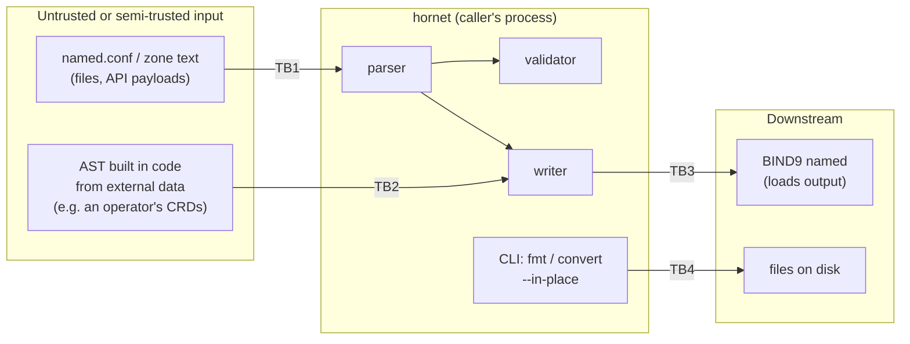

# Threat Model

**Last Updated:** 2026-10-05
**Version:** 1.1
**Last full pass 2026-10-05, against ADR-0001 ... ADR-0002**

This is hornet's threat model: what it protects, who can reach it, where the
trust boundaries are, and which control (or accepted risk, or open finding)
answers each threat. It is maintained under the Architecture Driven Development
rule (`.claude/rules/architecture-driven-development.md`): every implemented ADR
ends with a full pass over this page and a bump of the stamp above.

This pass was verified against `main` @ `10fee80` by reading `src/` and by
running probes against the library.

---

## 1. System overview

hornet is a single Rust crate, `hornet-bind9`, released under Apache-2.0:

- a **library** that parses BIND9 `named.conf` and RFC 1035 zone files into an
  AST (`src/parser/`, built on `winnow`), writes an AST back to text
  (`src/writer/`), and validates an AST (`src/validator/`);
- an optional **CLI**, `hornet` (feature `cli`, on by default), with `parse`,
  `zone`, `check`, `check-zone`, `fmt` and `convert` subcommands
  (`src/main.rs`).

hornet has no network surface, no daemon, no privileges of its own, no unsafe
code and no persistent state. It runs with whatever authority its caller has.
Its security relevance comes from **where its output goes**: BIND9 loads it, and
BIND9 is an internet-facing authoritative or recursive server.

## 2. Assets

| Asset | Why it matters |
|---|---|
| **Integrity of emitted configuration** | BIND9 trusts it completely. An injected `allow-update { any; };`, `allow-transfer`, an extra zone, or an extra resource record is a DNS takeover or data-exposure primitive. |
| **Fidelity of the parse** | Callers use hornet's AST and validator to decide whether a config is acceptable. If hornet reads a file differently from BIND9, a policy check passes on text BIND interprets otherwise. |
| **Availability of the calling process** | hornet runs inside CI linters, operators and tools that parse configs they did not write. |
| **User files touched by the CLI** | `fmt` and `convert --in-place` overwrite the file they read. |
| **Release artefacts** | Binaries, SBOMs and the crates.io package are consumed by other projects. |

## 3. Actors

| Actor | Capability |
|---|---|
| **Config author** | Writes `named.conf` / zone text that hornet parses. Fully trusted in the single-user CLI case; untrusted when hornet is used to vet submissions (a review bot, a multi-tenant operator). |
| **Data supplier to an embedding program** | Controls strings that the embedding program places into AST fields (zone names, TXT data, key names, file paths) before calling the writer. Never trusted. |
| **Embedding developer** | Calls the library. Trusted, but can only be as safe as the writer's escaping contract lets them be. |
| **Supply-chain attacker** | Targets a dependency, a GitHub Action, the release pipeline or the crates.io publish token. |

## 4. Trust boundaries

| ID | Boundary | What crosses it |
|---|---|---|
| **TB1** | Text into the parser | Arbitrary bytes from a file or string, size unbounded by hornet |
| **TB2** | Caller-built AST into the writer | Arbitrary `String` values in AST fields, including the raw `extra`, `Statement::Unknown` and `RData::Unknown` carriers |
| **TB3** | Writer output into BIND9 | Text BIND9 parses with its own lexer and quoting rules |
| **TB4** | CLI to filesystem | Read of a user-supplied path; for `fmt` and `convert --in-place`, an overwrite of that path |
| **TB5** | Source to release | GitHub Actions, third-party actions, crates.io dependencies, the publish token |

## 5. STRIDE analysis

| # | STRIDE | Threat | Boundary | Control / disposition |
|---|---|---|---|---|
| T1 | **T**ampering | A string in an AST field breaks out of its quoting in the writer and injects directives or records into the emitted config | TB2, TB3 | Partial. `named.conf` quoted fields go through `writer::escape` (escapes `"` and `\`), so a quoted value cannot close its own string. Other writer paths: open finding, tracked privately (section 6). The raw carriers (`extra`, `Statement::Unknown`, `RData::Unknown`) are emitted verbatim by design and must only hold trusted text. |
| T2 | **T**ampering | hornet's parse differs from BIND9's, so a config passes hornet's validator but BIND9 loads something else | TB1, TB3 | Open finding, tracked privately (section 6). Mitigated going forward by the BIND9 e2e oracle (ADR-0001), which catches writer output BIND rejects but not parser divergence on input. |
| T3 | **D**enial of service | Crafted or merely large input makes parsing super-linear | TB1 | Open finding, tracked privately (section 6). |
| T4 | **D**enial of service | Deep nesting overflows the stack | TB1 | **Not exposed.** The named.conf grammar hornet implements is not recursive: address-match-list negation is one level (`!elem`), nested `{ }` lists are not parsed, views contain zones only, and the `Unknown` statement fallback (`unknown_stmt`) and `take_to_semi` track brace depth with an iterative counter, not recursion. The writer recurses only along the same fixed structure. |
| T5 | **D**enial of service | Huge input exhausts memory | TB1, TB4 | Accepted risk **AR1**. `parse_named_conf_file` / `parse_zone_file_from_path` read the whole file with `read_to_string`; there is no size cap. |
| T6 | **I**nformation disclosure / **E**levation | `include` or `$INCLUDE` makes hornet read files outside the intended tree (path traversal) | TB1, TB4 | **Not exposed.** hornet never follows includes: `include "path";` becomes `Statement::Include(path)` and `$INCLUDE` becomes `Entry::Include { file, .. }`; neither is opened. The CLI reads only the path given on its command line. Consumers that resolve includes themselves own that check. |
| T7 | **T**ampering | `fmt` / `convert --in-place` silently destroys content | TB4 | The parser does not preserve comments, so an in-place rewrite removes them (open finding, section 6). Writes are a plain `std::fs::write` (non-atomic, follows symlinks); acceptable for a user-invoked CLI, see **AR2**. |
| T8 | **R**epudiation | A change to parser/writer behaviour lands without a record | TB5 | `.claude/CHANGELOG.md` entries with a mandatory `**Author:**`, signed and signed-off commits verified in CI (`verify-signed-commits`), ADRs for behaviour-changing decisions. |
| T9 | **T**ampering | A compromised dependency or GitHub Action ships in a release | TB5 | Small dependency surface (`winnow`, `thiserror`, `miette`, optional `clap` / `serde`); `cargo audit` in CI; SPDX header check; Cosign-signed release tarballs, CycloneDX SBOMs and SLSA provenance; actions pinned by commit SHA and Dependabot-tracked (ADR-0001). Coverage tooling (ADR-0002) adds `cargo-llvm-cov` (installed by a SHA-pinned action) and a Codecov upload; neither affects what is built or released, and Codecov is a reporting sink, never a gate. |
| T10 | **S**poofing | A forged hornet release or crate | TB5 | Cosign keyless signatures and SLSA provenance on GitHub release assets. crates.io publication relies on the `CARGO_REGISTRY_TOKEN` secret, scoped to the release job. |
| T11 | **I**nformation disclosure | TSIG secrets in `key` statements leak via error output | TB1 | Low. Parse errors carry the source text in a `miette::NamedSource`; a caller that prints diagnostics for a file containing `secret "..."` can echo it. The validator does not log key material. Callers handling secrets should not forward diagnostics to shared logs. |

## 6. Findings

Open findings from the 2026-10-05 pass are tracked privately until they are
remediated, per the coordinated-disclosure policy in
[`SECURITY.md`](https://github.com/firestoned/hornet/blob/main/SECURITY.md). Each moves here, with its fix and the test that pins it, once
it lands. The STRIDE rows above that say "open finding" refer to these.

## 7. Accepted risks

| ID | Risk | Why accepted | Revisit when |
|---|---|---|---|
| **AR1** | No input size limit; files are read fully into memory | hornet's inputs are config files, normally kilobytes to low megabytes. Callers that accept untrusted uploads can bound size before calling hornet. | Parse time is confirmed linear in input size, or hornet is embedded in a service that accepts uploads. |
| **AR2** | `fmt` / `convert --in-place` use a non-atomic `std::fs::write` that follows symlinks | The CLI is user-invoked on the user's own files with the user's own permissions; it is not a privileged tool. | hornet's CLI is run by a privileged process or on paths an untrusted party controls. |
| **AR3** | `named-checkconf` acceptance (ADR-0001) is necessary, not sufficient | The checkers validate syntax and much semantics but do not load a running server. | A defect reaches a release that `named-checkconf` accepted but `named` rejected at load. |

## 8. Supply chain

- **License:** Apache-2.0, with SPDX headers enforced in CI.
- **Dependencies:** `winnow`, `thiserror`, `miette`; optional `clap` (pinned to
  `=4.4.18`) and `serde`. `cargo audit` and `cargo deny`
  run in CI. `Cargo.lock` is not committed today (see roadmap 01).
- **CI:** composite actions from `firestoned/github-actions`; third-party
  actions pinned by commit SHA and updated by Dependabot, with auto-merge gated
  on the BIND9 e2e suite (ADR-0001, roadmap 01).
- **Coverage reporting (ADR-0002):** coverage jobs upload LCOV to Codecov with
  the `CODECOV_TOKEN` repository secret. The workflows trigger on
  `pull_request`, not `pull_request_target`, so fork and Dependabot runs never
  receive the token and upload tokenless. A leaked token could only falsify
  Codecov's reports, which gate nothing: the 100% gate is `make coverage` in
  hornet's own job. The instrumented e2e binary is a CI artefact only, never
  released.
- **Release:** signed commits verified, Cosign keyless signatures on binary
  tarballs, CycloneDX SBOM per binary, SLSA build provenance, checksums.
